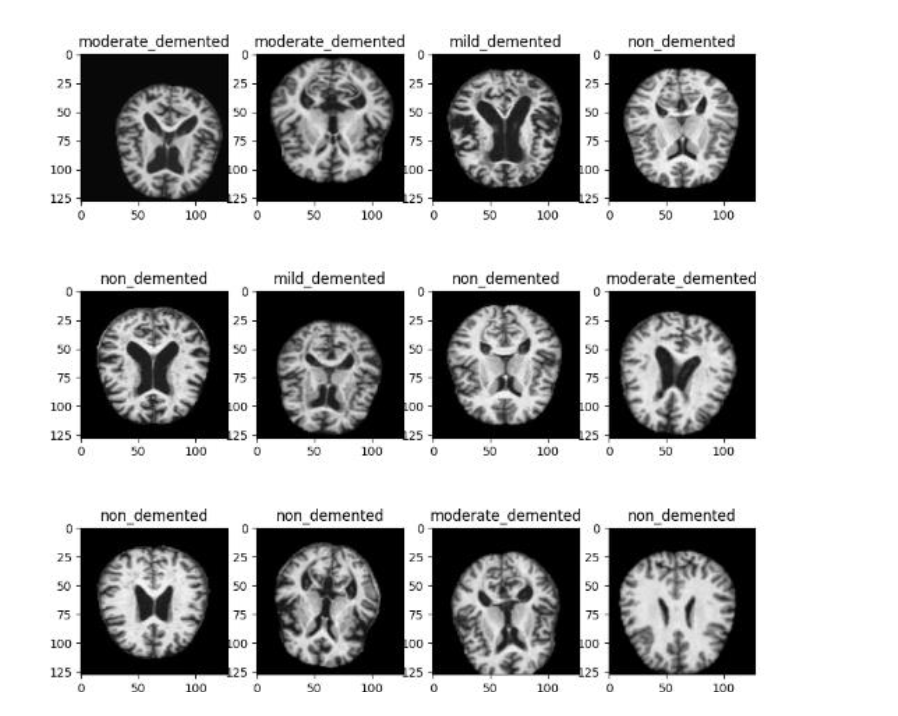

## Detection of Alzheimer’s Disease Using Transfer Learning Methods on MRI images

CourseWork:-Machine Learning

----

##  📌 Overview

Alzheimer’s disease is a progressive neurodegenerative disorder that affects memory, cognition, and behavior. Early and accurate detection is crucial, as the disease is irreversible in later stages. 

This project focuses on the **early detection and classification of Alzheimer’s Disease (AD)** using **MRI brain images** and **deep learning models** with transfer learning. The goal is to accurately classify different stages of Alzheimer’s disease to support early diagnosis and clinical decision-making.

----
## 🛠 Technologies & Tools

- **Programming Language:** Python  
- **Deep Learning:** TensorFlow, Keras  
- **Libraries:** NumPy, Pandas, Matplotlib  
- **Models:** CNN, VGG16, ResNet50, DenseNet-121  
- **Domain:** Medical Image Analysis, Deep Learning

---

## 🗂 Dataset

- **Source:** Publicly available Kaggle MRI dataset  
- **Total Images:** ~6400 MRI scans  
- **Classes:**
  - Non-Demented  
  - Very Mild Demented  
  - Mild Demented  
  - Moderate Demented  

Data imbalance was handled using **data augmentation techniques**.

### 📷 Sample MRI Images from the Dataset

<p align="center">
  
</p>

<p align="center">
  <em>Figure 1: Sample MRI images representing different stages of Alzheimer’s disease.</em>
</p>

---

## 📁 Repository Structure

```
├── Source_code.ipynb # Model implementation and experiments
├── Final_projectreport.pdf # Detailed project report
├── README.md # Project documentation

```
---

## 🧪 Methodology

### 🔹 Data Preprocessing
- Image resizing and normalization  
- Data augmentation using `ImageDataGenerator`  
- Train / Validation / Test split  

### 🔹 Models Implemented
- **Custom CNN**
- **VGG16** (Transfer Learning)
- **ResNet50** (Transfer Learning)
- **DenseNet-121** (Transfer Learning)

Pretrained models were fine-tuned by freezing base layers and training custom fully connected layers.

---

## ⚙️ Model Architecture Highlights

- Convolution + Batch Normalization + Max Pooling
- Fully connected dense layers with Dropout
- Softmax output layer for multi-class classification

---

## 📊 Results & Evaluation

- **VGG16 achieved the best overall performance**, showing better generalization on unseen data.
- Evaluation metrics used:
  - Accuracy
  - Precision
  - Recall
  - F1-score

### 🔑 Key Observation

VGG16 outperformed ResNet50 and DenseNet-121, particularly in handling class imbalance and achieving stable validation accuracy.

---

## 🚀 Future Work

- Fine-tuning deeper layers of ResNet50 and DenseNet121
- Experimenting with hyperparameter optimization
- Using larger and more diverse MRI datasets
- Exploring explainable AI (XAI) techniques for model interpretability
